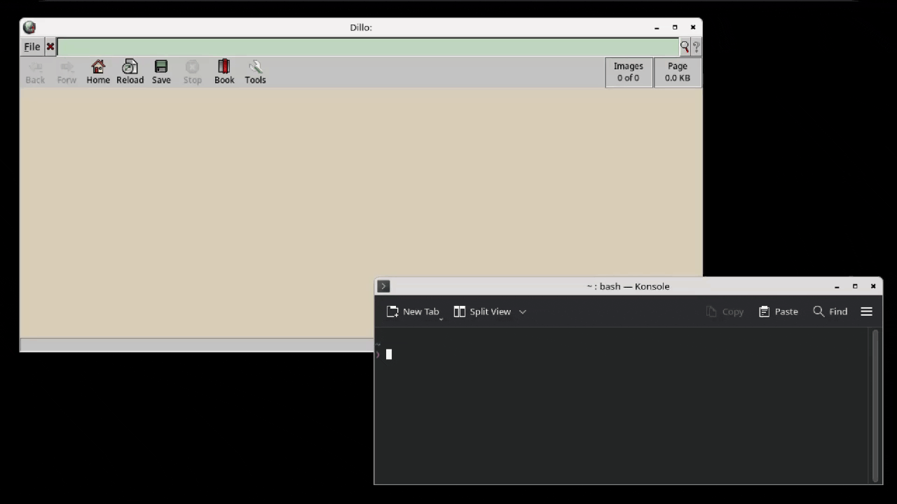

# spout
the missing link between your screenshot tool and the internet.

Most screenshot tools want to own your entire workflow — hotkey, capture, upload, all bundled together. spout doesn't care about any of that. It just reads bytes from stdin and gives you a URL. What produces those bytes is your problem.
It's a pipe segment. That's it.
## Install
```sh
git clone https://github.com/Gur0v/spout
cd spout
cargo build --release
cp target/release/spout ~/.local/bin/
```
#### Arch Linux (AUR)
```sh
paru -S spout      # stable
paru -S spout-git  # git HEAD
```
## Configure
> [!IMPORTANT]
> Copy `config.kdl` from the repo to `~/.config/spout/config.kdl` and edit it to your liking.
The config is looked up at `$XDG_CONFIG_HOME/spout/config.kdl`, falling back to `~/.config/spout/config.kdl` if `$XDG_CONFIG_HOME` is unset.

The config format is [KDL](https://kdl.dev). It's like JSON but for humans.
Two profiles are included as a starting point. `litterbox` is ephemeral — files expire after 24 hours. `catbox` is permanent. Pick whichever matches your threat level.
```kdl
default "litterbox"
// wl-copy for Wayland, or uncomment one of the X11 alternatives
clipboard "wl-copy"
// clipboard "xclip" "-selection" "clipboard"
// clipboard "xsel" "--clipboard" "--input"
profile "litterbox" {
    url "https://litterbox.catbox.moe/resources/internals/api.php"
    method "POST"
    format "multipart"
    file-field "fileToUpload"
    field "reqtype" "fileupload"
    field "time" "24h"
    path "."
    filename prefix="ss_" random=8 extension="png"
}
profile "catbox" {
    url "https://catbox.moe/user/api.php"
    method "POST"
    format "multipart"
    file-field "fileToUpload"
    field "reqtype" "fileupload"
    path "."
    filename random=8 extension="png"
}
```
### Top-level options
| Field | Description |
|---|---|
| `default` | Profile name to use when none is specified on the command line. |
| `clipboard` | Command (plus any arguments) to receive the URL on stdin. Runs after every successful upload. Omit to disable. |

### Profile options
| Field | Description |
|---|---|
| `url` | Upload endpoint. `{filename}` is replaced with the generated filename before the request is sent. |
| `method` | `POST` or `PUT` |
| `format` | `multipart` or `binary` |
| `file-field` | The multipart field name for the file. Defaults to `file`. |
| `field` | Extra multipart fields. Repeatable. |
| `header` | Extra request headers — auth tokens, content types, etc. Repeatable. |
| `path` | Dot-separated key path into the JSON response to find the URL (e.g. `data.url`). Use `"."` for plain-text responses. |
| `filename` | Controls the generated filename. All properties are optional: `prefix` (string prepended to the name), `random` (N random hex bytes appended), `extension` (file extension). Falls back to `ss.png` if omitted entirely. |

If you're pointing spout at your own backend, `header` is where your auth token goes and `path` is how you tell it where to find the URL in whatever JSON your server returns.

## Use
```sh
# check your config for errors before anything else
spout -p

# pipe anything in, get a URL out
flameshot gui -r | spout

# use a specific profile
flameshot gui -r | spout catbox

# override the file extension
cat image.jpg | spout -x jpg

# override the filename entirely
cat image.png | spout -n my-screenshot.png

# works with anything that produces bytes
cat image.png | spout
```

URL goes to stdout. URL also goes to your clipboard. That's the whole program.

### Flags
| Flag | Description |
|---|---|
| `-p` | Parse and validate the config file, then exit. |
| `-n NAME` | Override the uploaded filename entirely. If used with `-x`, the extension is appended. |
| `-x EXT` | Override the file extension only, ignoring the one set in the profile. |
| `-v` | Print the version and exit. |
| `-h` | Print usage and exit. |

## Status
Verified on Linux (Spectacle, Flameshot, Grim, Scrot), FreeBSD and OpenBSD. HTTP/1.1 is strictly enforced for compatibility with legacy backends.

Windows is out of scope — use [ShareX](https://getsharex.com/). macOS is untested due to lack of hardware; it may work with a custom clipboard script, but is unsupported.

## License
[GPL-3.0](LICENSE)
